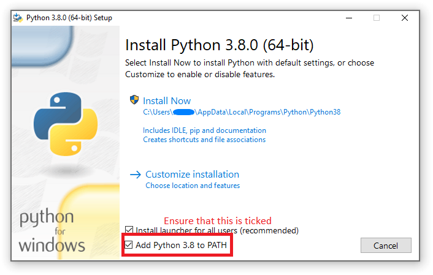

# User Manual: Fault Simulator and PODEM


## User Manual: PODEM

### Simulation environment 


This code depends on the Python 3.8+.

Install python for your operating system from https://www.python.org/downloads/. Ensure that Python is added to path when installing on Windows as shown in the image below.

||
| :--: |
| *Check the option to Add to path* |


### Running the PODEM vector generator

First write the faults to be tested for in a file in the following format

faultFile.txt

```
Net 5 s-a-1
Net 1 s-a-0
Net 3 s-a-0
```

Here Net number 5 is stuck at 1, Net number 1 is stuck at 0 and net number 3 is stuck at 0. 

To run the simulator on a circuit names s27.txt located in the files folder relative to the PODEM.py script, and fault file named faultFile.txt in the files folder relative to the PODEM.py script, run the following command. The --cktFile gives the relative or full path for the circuit file and --faultFile gives the path to the faults file.

```
python PODEM.py --cktFile .\files\s27.ckt --faultFile .\files\faultFile.txt
```
Expected output
```
Net 5 s-a-1 - X0X10X0
Net 1 s-a-0 - 1XXX1XX
Net 3 s-a-0 - X11XXXX
```

### PODEM with deductive fault simulator

To verify the PODEM output with the deductive fault simulator, give the --dfs flag with the same command as the previous section. This will automatically test the output vectors with the deductive fault simulator.

```
python PODEM.py --cktFile .\files\s27.ckt --faultFile .\files\faultFile.txt --dfs
```

Expected output

```diff
Net 5 s-a-1 - X0X10X0
Deductive Fault Simulator Passed.
Net 1 s-a-0 - 1XXX1XX
Deductive Fault Simulator Passed.
Net 3 s-a-0 - X11XXXX
Deductive Fault Simulator Passed.
```

### PODEM with fanouts

To run PODEM with fanouts considered, use the --fanout flag
```
python PODEM.py --fanout --cktFile .\files\s27.ckt --faultFile .\files\faultFile.txt --dfs
```

With fault file having the Fanout nodes specified

```
Net 5FO s-a-1
Net 5_1 s-a-0
```

Expected output

```diff
Net 5 s-a-1 - X0X10X0
Deductive Fault Simulator Passed.
Net 1 s-a-0 - 1XXX1XX
Deductive Fault Simulator Passed.
Net 3 s-a-0 - X11XXXX
Deductive Fault Simulator Passed.
```